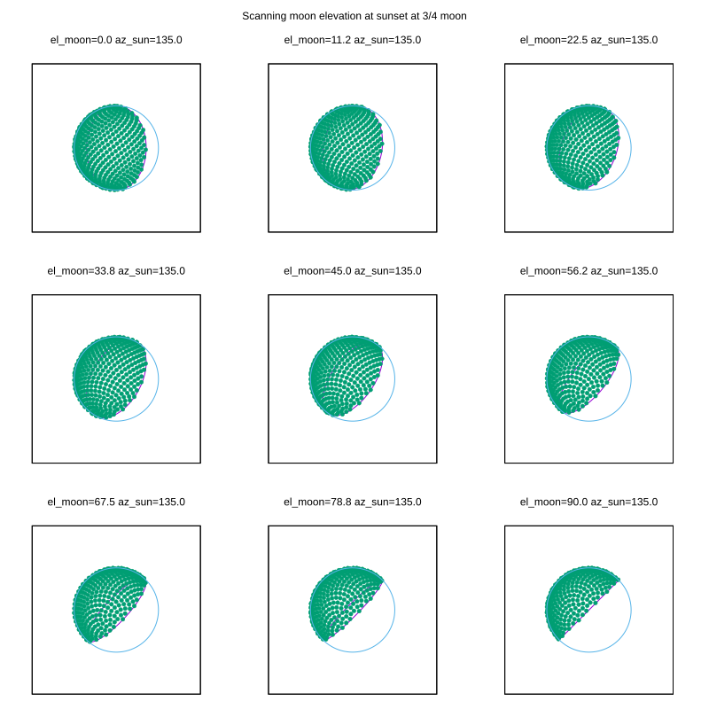
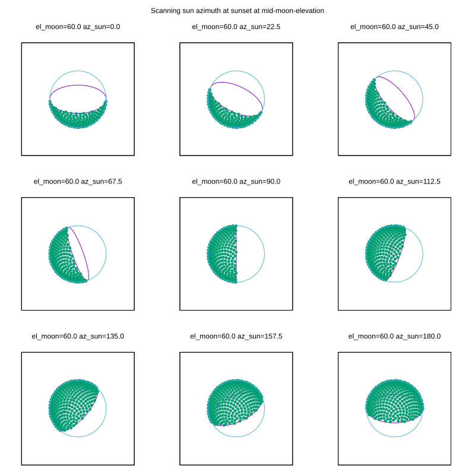

We answer the question: *why is the moon pointing up*?

There's an optical illusion known by names like the "lunar terminator paradox".
This has much discussion and descriptions online, but none made sense in my
head, so I wrote this program to figure out what was going on. The paradox:

- The moon is illuminated by the sun
- After sunset, the sun is below, so we would expect the illuminated portion of
  the moon to point down, towards where the sun is
- This isn't what always happens!

I was camping in the mountains with a friend recently. We were looking up at the
sky, just after the sun has set. The moon was clearly pointing up.

After playing with this program, I have clarity: we're looking up at the moon
from below. The most pathological case is a full moon. Let's say the moon is on
the horizon: elevation=0. If we're looking at this low moon, and the moon is
full, the sun is directly behind us. The moon is fully illuminated, and we see
100% of the moon disc lit up.

Now, what happens if the moon is not at the horizon, but higher up at the sky?
Effectively, the sun is infinitely far away, so the same part of the moon is lit
up. But we're now looking at the moon from below, and we would see some of the
dark side on the bottom edge. I.e. the moon appears bright at the top, but has a
dark slice missing at the bottom: it points up! Even at sunset.

This is the most clearly weird case. A half-moon has no paradoxical behavior,
and the more full the moon, the more clearly we can observe the bright moon
pointing up despite the sun being down.

I produce two plots. At 3/4-full moon at sunset we look at the moon as it rises
from the horizon all the way up to the zenith:

If the moon is at the horizon (elevation = 0), we see the expected 3/4-lit disc.
As the moon rises, we see more and more of its bottom, and thus more and more
dark areas show up: It clearly points up at sunset!

We can also move the sun around. Let's say the moon is 60deg up; let's move the
sun from new-moon to a full-moon:

In the darkest configuration, we can still see a lit crescent on the bottom: the
illumination is all on the opposite side, but we can see a slice of the
illuminated back side. As the sun swings around, we see more and more of the
moon. At azimuth = 90deg, we have a half-lit moon. Past that, more and more of
the moon is visible, always pointing up.
